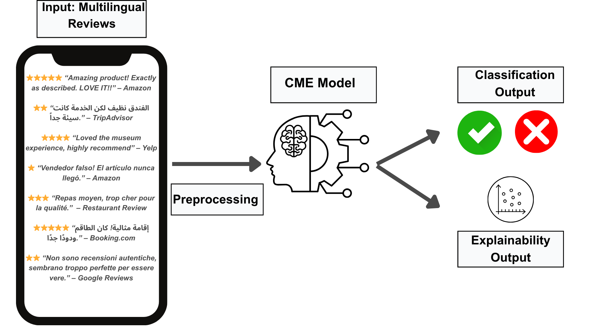
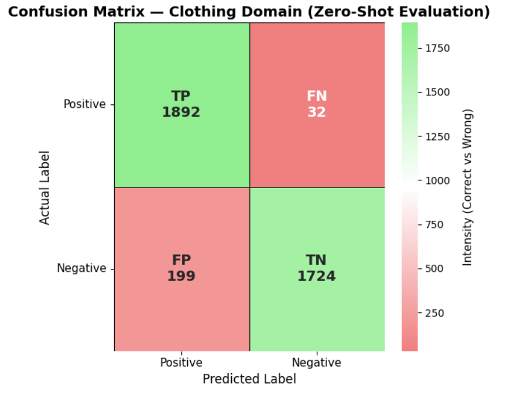
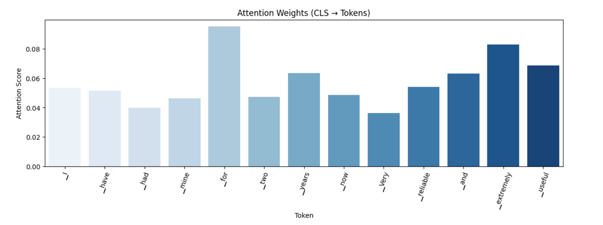
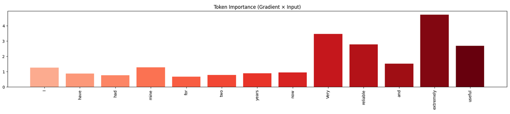

# Cross-Domain & Multilingual Fake Review Detection Using CME

A multilingual and cross-domain fake review detection framework based on **XLM-RoBERTa** with built-in explainability using attention visualization.

---

## Overview

This project introduces **CME (Cross-domain, Multilingual, and Explainable)**, a transformer-based framework designed to detect fake online reviews across multiple languages and domains.

Unlike traditional fake review detection systems that are limited to a single language or domain, CME combines:

- multilingual learning
- cross-domain adaptability
- attention-based explainability

into one unified framework.

The model was trained using multilingual review datasets containing both **English** and **Arabic** reviews from different domains such as:

- hotels
- restaurants
- e-commerce
- product reviews

The framework was also evaluated in a **zero-shot setting** using an entirely unseen clothing review dataset to test real-world adaptability.

---

## Problem Statement

Fake online reviews manipulate consumer trust, damage business credibility, and reduce the reliability of recommendation systems.

Existing fake review detection systems suffer from several limitations:

- Most are monolingual
- Most only generalize within one domain
- Many behave like black-box systems
- Explainability often relies on computationally expensive tools such as SHAP or LIME

This project addresses these limitations by developing a unified multilingual and explainable framework.

---

## CME Framework

The CME pipeline processes multilingual reviews through preprocessing and classification stages while also generating explainability outputs.

## System Model



---

## Key Features

### Multilingual Detection
- Supports both English and Arabic reviews
- Uses XLM-RoBERTa multilingual embeddings

### Cross-Domain Generalization
- Trained across multiple review domains
- Evaluated on unseen clothing review datasets

### Explainable AI
- Attention-based explainability
- Token importance visualization
- No external explainability framework required

### Zero-Shot Evaluation
- Successfully evaluated on unseen domains without retraining

---

## Datasets

The model was trained using a merged multilingual dataset composed of:

### 1. Arabic Reviews Dataset
Contains:
- hotel reviews
- restaurant reviews
- product reviews

### 2. Deceptive Opinion Spam Corpus
English hotel reviews from TripAdvisor.

### 3. Amazon Fake Review Dataset
Large-scale English e-commerce review dataset.

---

## Final Dataset Statistics

| Property | Value |
|---|---|
| Languages | English + Arabic |
| Domains | Hotel, Restaurant, E-commerce |
| Dataset Size | ~40,000 samples |
| Training Split | 80% |
| Testing Split | 20% |

---

## Data Preprocessing

The preprocessing pipeline included:

- removing duplicates
- cleaning special characters
- multilingual tokenization
- label standardization
- balancing fake and real reviews
- domain labeling
- language labeling

The XLM-RoBERTa tokenizer was used for multilingual encoding.

---

## Model Architecture

| Component | Details |
|---|---|
| Base Model | XLM-RoBERTa |
| Task | Binary Classification |
| Optimizer | AdamW |
| Learning Rate | 2e-5 |
| Batch Size | 16 |
| Epochs | 2 |
| Loss Function | Binary Cross Entropy |

---

## Training Environment

Training was conducted using:

- Google Colab
- NVIDIA T4 GPU
- PyTorch
- HuggingFace Transformers

---

## Results

### Internal Test Set Performance

| Metric | Score |
|---|---|
| Accuracy | 89% |
| Precision | 0.84 |
| Recall | 0.94 |
| F1-Score | 0.89 |

---

## Zero-Shot Cross-Domain Evaluation

The model was tested on a completely unseen clothing review dataset.

| Metric | Score |
|---|---|
| Accuracy | 70% |
| Precision | 69% |
| Recall | 68% |
| F1-Score | 69% |

### Confusion Matrix



The results demonstrate that CME generalizes effectively to unseen domains without retraining.

---

## Explainability

CME integrates built-in explainability through transformer attention mechanisms.

Instead of relying on external frameworks such as SHAP, the model directly visualizes influential tokens that contributed to the prediction.

### Attention-Based Token Importance



The visualization highlights words that strongly influenced the prediction.

---

## Gradient × Input Token Importance

Additional explainability analysis was performed using Gradient × Input attribution.



---

## Comparison with Existing Work

CME was compared against COAT, a leading cross-domain fake review detector.

| Model | Accuracy | Precision | Recall | F1-score |
|---|---|---|---|---|
| COAT | 67.74% | 68.82% | 70.24% | 69.83% |
| CME | 70% | 69% | 68% | 69% |

### Advantages of CME

- multilingual capability
- explainability integration
- stronger zero-shot adaptability
- unified architecture

---

## Repository Structure

```text
multilingual-fake-review-detection/
│
├── code/
│   └── CME.ipynb
│
├── report/
│   └── MachineLearningResearchPaper.pdf
│
├── presentation/
│   └── Cross-Domain-and-Multilingual-Fake-Review-Detection-Using-CME.pptx
│
├── images/
│   ├── system_model.png
│   ├── confusion_matrix.png
│   ├── attention_visualization.png
│   └── gradient_input.png
│
├── README.md
├── requirements.txt
└── .gitignore
```

---

## Installation

Clone the repository:

```bash
git clone https://github.com/YOUR_USERNAME/multilingual-fake-review-detection.git
cd multilingual-fake-review-detection
```

Install dependencies:

```bash
pip install -r requirements.txt
```

---

## Requirements

Example `requirements.txt`:

```text
torch
transformers
datasets
pandas
numpy
scikit-learn
matplotlib
jupyter
```

---

## Running the Project

Launch Jupyter Notebook:

```bash
jupyter notebook
```

Open:

```text
CME.ipynb
```

Run all notebook cells sequentially.

---

## Technologies Used

- Python
- PyTorch
- HuggingFace Transformers
- XLM-RoBERTa
- Machine Learning
- Deep Learning
- Natural Language Processing (NLP)
- Explainable AI (XAI)
- Attention Mechanisms
- Cross-Domain Learning
- Multilingual NLP

---

## Research Contributions

This project contributes:

- a multilingual fake review detection framework
- cross-domain evaluation methodology
- attention-based explainability integration
- zero-shot domain testing
- unified multilingual + explainable architecture

---

## Limitations

- Only two languages were evaluated
- Attention maps provide partial interpretability
- Some genuine reviews may be over-flagged
- Performance may vary across domains

---

## Future Work

Possible future improvements include:

- expanding language support
- adding more review domains
- improving explainability techniques
- integrating multimodal review analysis
- experimenting with larger transformer models

---

## References

The full list of references can be found in:

```text
report/MachineLearningResearchPaper.pdf
```

---

## License

This project is intended for academic and educational purposes.